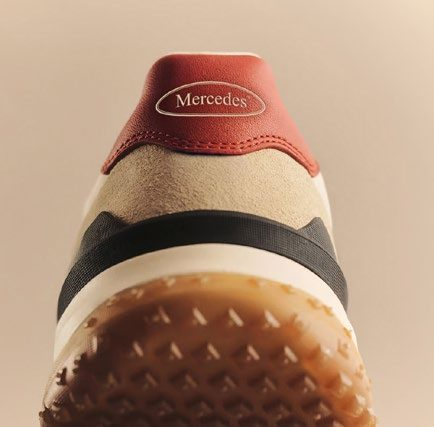
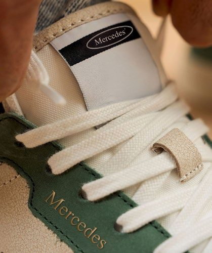
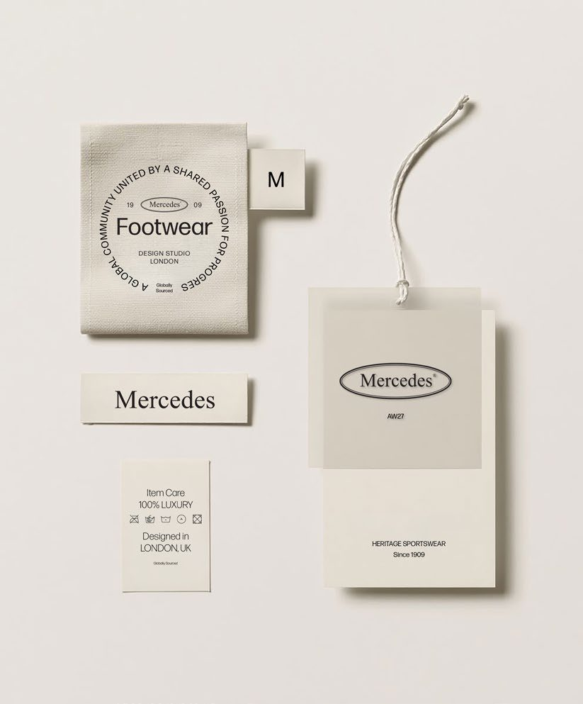
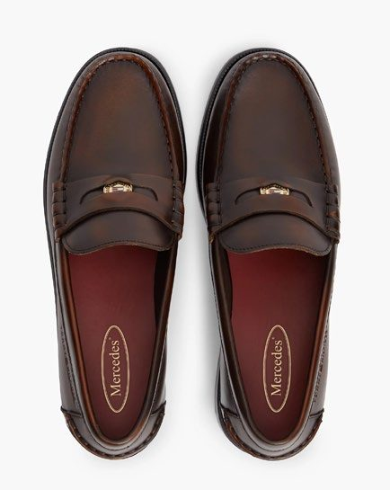

::: hinweis
**Klickdummy, Stand 9. Oktober 2026.** Alle Angaben stammen aus dem
Mercedes-Styleguide (V2, 03.10.2026) und der DELTEX-Präsentation
„Discount for Brands" (28.08.2026). Was noch fehlt, steht in Abschnitt 10.
:::

## In dreißig Sekunden

!! Eine Schuhmarke mit eingetragener Historie **seit 1909**. Zwei fertige
Kollektionen, ein abgeschlossener Styleguide, eine Preisarchitektur, die das
Volumengeschäft nicht nachträglich dazurechnet, sondern von Anfang an kennt.

::: kennzahlen
1909 | Marke eingetragen seit
5 | Schutzgebiete, alle eingetragen
2 | Kollektionen, beide ausgearbeitet
35 | Euro Einstiegspreis im Volumenband
:::

::: kapitel bilder/detail-innensohle.jpg
nummer: Kollektion eins — Members Only
## Signiert, nicht geschrien.

Vom Court Classic bis zum handgefinishten Loafer. Premium-Materialien,
zurückhaltendes Branding, eine Silhouette, die auch in fünf Jahren nicht
komisch aussieht.
:::

## Wofür die Marke steht

::: bildwand bilder/welt-club.jpg
### Qualität
Ehrliche Materialien, präzise Verarbeitung und Details, die man beim hundertsten Tragen noch bemerkt. Der Styleguide formuliert es als Haltung: *Qualität ist kein Versprechen, sondern der Standard.*

### Stil
Zeitlos, nie dem Trend hinterher. Die Formensprache schöpft aus einem Jahrhundert Sport und Schneiderhandwerk — übersetzt in das, was Menschen heute tragen.

### Zugehörigkeit
Eine Welt, zu der man gehören möchte. Verkauft wird das Gefühl von Clubhaus und Sonntagsspiel — nicht nur der Schuh.
:::

::: zitat
Unser Kunde bewegt sich mühelos zwischen Clubhaus und Stadt. Er schätzt Handwerk mehr als Logos und Herkunft mehr als Hype. Sport ist Teil seines Lebens, kein Kostüm.
-- Mercedes Brand Guidelines, Kapitel „Our Customer"
:::

## Das Sortiment

::: slider nummeriert
### Court Classic, Navy
bild: bilder/artikel-court-navy.jpg
Members Only. Court-Silhouette, Wildleder-Partien, Kontrastbesatz in Cognac.

### Court Classic, Racing Green
bild: bilder/artikel-court-green.jpg
Members Only. Heller Court-Schuh mit Fersenkappe in Racing Green.

### Court Classic, Bone
bild: bilder/artikel-court-cream.jpg
Members Only. Durchgefärbter Court-Schuh in Bone mit Lederbesatz.

### Penny Loafer, Oxblood
bild: bilder/produkt-loafer.jpg
Members Only. Klassischer Loafer in Oxblood, handgefinisht.

### Trail, Signal Orange
bild: bilder/artikel-trail-orange.jpg
Run Club. Trail-Profil mit tiefem Stollenbild, Mesh-Obermaterial.

### Runner, Bone
bild: bilder/artikel-runner-weiss.jpg
Run Club. Leichter Straßenläufer, voluminöse Dämpfung.
:::

## Woran man es erkennt {hell}

Drei Dinge nennt der Styleguide als Qualitätsmerkmale — und sie sind am
fertigen Schuh nachprüfbar, nicht nur behauptet.

::: galerie

:::

- **Qualität** — Premium-Wildleder und Vollnarbenleder, von Hand ausgewählt, mit präziser sichtbarer Naht
- **Stabilität** — strapazierfähige Gummilaufsohle mit tiefem Profil, mit der Marke geprägt
- **Atmungsaktiv** — perforiertes Obermaterial und Lederfutter

!! **Vollständig spezifiziert ist im Styleguide bisher eine Ausführung** — der
Court Classic in Cigar Brown. Sie zeigt das Niveau, auf dem die Kollektion
aufsetzt.

::: fakten
Obermaterial | Wildleder 100 %
Futter | Kalbsleder 100 %
Sohle | Gummi 100 %, Naturgummi-Laufsohle
Ausstattung | Kontrastferse in Bone, runde Spitze, Baumwollschnürsenkel
Entworfen in | London
:::

::: kapitel bilder/band-run-club.jpg
nummer: Kollektion zwei
script: Run Club
## Dieselbe Marke, anderes Tempo.

Die Energie der Laufkultur in der Welt des Luxus-Lifestyles. Leichte
Strickobermaterialien, reaktive Dämpfung, Trail-Grip — und Signalorange neben
Logo und Schriftzug, ohne die Handschrift zu verlieren.
:::

## Preisarchitektur {versetzt}

!! Der Styleguide rechnet drei Preislagen und ordnet jeder einen Kanal zu.
Die linke Spalte ist Ihre — sie heißt dort *Sports and value retail*.

| Kategorie | Volume | Contemporary | Premium |
|---|---|---|---|
| Sneakers | **35–50 €** | 55–75 € | 88–123 € |
| Leder-Schnürer | **40–55 €** | 60–85 € | 98–148 € |
| Loafer | **40–55 €** | 60–85 € | 98–138 € |
| Boots | **45–65 €** | 70–95 € | 113–163 € |
| Run Club | **35–50 €** | 55–75 € | 80–110 € |
| **Kanal** | **Sports and value retail** | Multi-brand fashion | Premium department & e-commerce |

UVP-Bänder in Euro, inklusive Mehrwertsteuer. Quelle: Mercedes Brand Guidelines
2026, V2. **Das sind Verkaufspreise, keine Einkaufspreise** — die Kalkulation
kommt mit dem Angebot.

## Markenschutz

Die Marke ist in allen für den europäischen Handel relevanten Gebieten
**eingetragen** — keine offene Anmeldung, keine Anwartschaft.

| Gebiet | Eintragung | Status |
|---|---|---|
| Deutschland | national, 1909 | eingetragen |
| Österreich, Benelux, Tschechien, Frankreich, Italien, Spanien, Schweiz | international, 1964 | eingetragen |
| China | international, 1999 | eingetragen |
| Vereinigtes Königreich | national, 2010 | eingetragen |
| Europäische Union | EU-Marke, 2010 | eingetragen |

Für Indien läuft eine Anmeldung.

## Was im Styleguide steht {hell}

!! **31 Seiten, Fassung V2 vom 3. Oktober 2026.** Kein Moodboard, sondern eine
fertige Markenanleitung. Niemand muss die Marke erst erfinden — sie ist
beschrieben, bis hin zur Naht und zum Anhänger.

::: karten
### Marke und Haltung
bild: bilder/welt-cafe.jpg
Markenkern, Kundenbild und drei Werte — Qualität, Stil, Zugehörigkeit. Jeder mit einer Definition, an der man eine Entscheidung festmachen kann.

### Schrift und Farbe
bild: bilder/detail-zunge.jpg
Forma als Hausschrift, Snell Roundhand ausschließlich für Kollektionsnamen und Kampagnentitel. Die Palette kommt aus den Materialien: Cigar Brown, Racing Green, Oxblood, Navy, Bone.

### Logo-System
bild: bilder/etiketten.jpg
Oval, Wortmarke und gestapelte Fassung mit „Schuhe seit 1909" — alle auf demselben Raster, mit Schutzraum und hellen wie dunklen Varianten.

### Zwei Kollektionen
bild: bilder/welt-tennis.jpg
Members Only und Run Club, jeweils mit Kollektionsbild, Produktbeispiel, Materialangaben und Qualitätsmerkmalen.

### Digital und Kampagne
bild: bilder/welt-villa.jpg
Vorgaben für Shop, Mobilansicht, Anzeigen und Großflächen. Auf dem Handy zuerst die Geschichte, dann der Kauf.

### Recht und Preis
bild: bilder/welt-golf.jpg
Markentabelle mit Gebieten und Eintragungsjahren, dazu die Preisarchitektur je Kanal.
:::

Ehrlich dazu: **Farbwerte in HEX oder Pantone nennt der Styleguide nicht** — die
Palette wird über Materialien und Produktfotos gezeigt. Für Verpackungsdruck
wird das nachgezogen.

## Alles aus einer Hand — oder einzeln

!! CGT verbindet Lizenz und Handel. Welche Bausteine Sie brauchen, entscheiden
Sie. Sie funktionieren einzeln und zusammen — und es gibt für alle einen
Ansprechpartner.

::: karten
### 01 — Lizenz
Die Markenrechte für Ihre Warengruppe. Zwei Modelle stehen zur Wahl: eine kurze Laufzeit mit Exklusivität für einen klar umrissenen Kundenkreis, oder ein mehrjähriger Vertrag mit Mengenzusage. **Welche Warengruppen und Territorien vergeben werden, halten wir im ersten Gespräch verbindlich fest.**

### 02 — Styleguide
Liegt fertig vor und ist Teil des Pakets. Kein Zusatzprojekt, keine Agenturrunde, kein halbes Jahr Vorlauf.

### 03 — Produktion
CGT nimmt geprüfte Produzenten ins Netzwerk auf und vermittelt sie. Das sichert, dass der Schuh am Ende so aussieht wie im Styleguide — und Sie müssen keinen Hersteller suchen.

### 04 — Handel
Der Weg ins Regal über DELTEX: Lebensmittelhandel, Discount, Fachhandel. Mehr dazu im nächsten Abschnitt.

### 05 — Online
Für eigenen Shop und Marktplätze ist eine gesonderte Online-Lizenz vorgesehen — getrennt vom stationären Geschäft, damit sich beides nicht ins Gehege kommt.
:::

Sie können alles nehmen oder nur die Marke. Wer schon produziert, lässt Baustein
drei weg; wer nur eine Aktion fahren will, braucht Baustein fünf nicht.

## Der Weg ins Regal {dunkel}

CGT bringt die Lizenz. Für die Umsetzung im Lebensmittel- und Discounthandel
arbeiten wir mit **DELTEX Handels GmbH** in Hamburg — einem Partner, der genau
das seit Jahren macht und nichts anderes.

::: kennzahlen
13.000 | ALDI Süd und Nord, Filialen
13.000 | LIDL, Filialen
4.400 | Netto, Filialen
1.600 | Kaufland, Filialen
:::

Dazu Edeka mit 6.500, REWE mit 3.800 und Penny mit 3.500 Filialen — Stand der
DELTEX-Partnerübersicht vom August 2026.

**So läuft eine Platzierung:**

- **Limited Drops** — zeitlich und mengenmäßig begrenzt, das beschleunigt die Kaufentscheidung
- **Exclusive SMU** — eigene Designs, Farben und Multipacks, klar getrennt vom Kernsortiment der Marke
- **Category Entry** — Einstieg über risikoärmere Warengruppen
- **Brand Control** — Produkt, Verpackung und Auftritt nach Markenstandard
- **Pricing Architecture** — ein Preis-Leistungs-Angebot, das im Regal funktioniert

## Marken, die diesen Weg schon gegangen sind {hell}

| Marke | Handelspartner |
|---|---|
| Adidas | ALDI |
| Nike | ALDI |
| PUMA | ALDI |
| Under Armour | ALDI |
| Scotch & Soda | ALDI |
| NFL | ALDI |
| BOSS | LIDL |
| Armani | LIDL |
| Diesel | LIDL |
| Reebok | LIDL |
| NBA | Kaufland |

Insgesamt nennt die DELTEX-Übersicht über 30 Marken im Lebensmittel- und
Discountkanal, darunter Bench, Camp David, Ellesse, Jack & Jones, MEXX und CR7.

## Was Einkäufer uns fragen

::: aufklapp
### Verwässert eine Discount-Platzierung nicht die Marke?
Genau dagegen ist die Preisarchitektur gebaut. Der Styleguide definiert drei getrennte Preislagen mit je eigenem Kanal — das Volumenband ist keine Ausnahme, sondern eine geplante Lage. Dazu kommt bei DELTEX das Prinzip **Exclusive SMU**: eigene Designs, Farben und Multipacks, die vom Kernsortiment der Marke klar getrennt sind.

### Ist die Marke wirklich geschützt?
Ja, und zwar eingetragen, nicht nur angemeldet: Deutschland seit 1909, die großen europäischen Märkte seit 1964, China seit 1999, Großbritannien und die EU-Marke seit 2010. Die vollständige Tabelle steht weiter oben.

### Gibt es die Schuhe schon irgendwo zu kaufen?
Der Styleguide ist auf 2027 datiert und die Marke sucht ausdrücklich Lizenzpartner in der EU, Großbritannien, China, Indien und den Golfstaaten. **Eine bestehende Handelsdistribution ist uns nicht dokumentiert** — wer jetzt einsteigt, ist früh dran.

### Wer entscheidet über Designs und Verpackung?
Das ist **offen**. Ein Freigabeprozess ist im Styleguide nicht beschrieben, und er gehört zu den Punkten, die wir vor einer Listung schriftlich festhalten. Wir sagen das lieber vorher als nachher.

### Wo wird produziert, und wie lange dauert Nachschub?
**Liegt uns nicht vor.** Produktionsstandort, Mindestabnahme und Wiederbeschaffungszeit klären wir im ersten Gespräch und liefern sie mit dem Angebot.
:::

## Was für die Listung noch fehlt

Diese Punkte sind bewusst nicht gefüllt, weil es dazu keine Quelle gibt. Sie
gehören ins erste Gespräch — nicht auf eine Hochglanzseite:

- **Artikelnummern, EAN, Größenlauf** je Modell
- **Einkaufspreis und Kalkulation** — oben stehen UVP-Bänder
- **Liefereinheit, Palettenmaße, Mindestabnahme, Lieferzeit**
- **Welche Modelle konkret für das Volumenband** produziert werden
- **Termine bis zur Listungsentscheidung**
- **Freigabe des Lizenzgebers für den Discountkanal** und der Approval-Prozess

## Anfrage

::: formular
titel: Was brauchen Sie als Nächstes?
knopf: Anfrage absenden
Muster, Kalkulation oder einen Termin — schreiben Sie kurz, worum es geht.
:::
